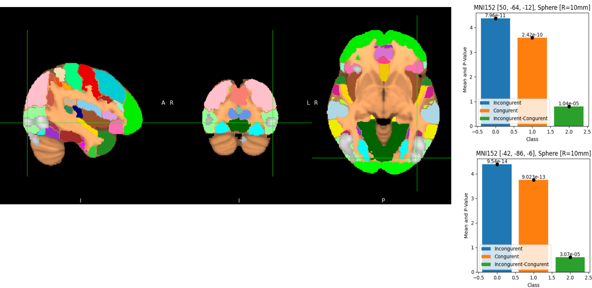
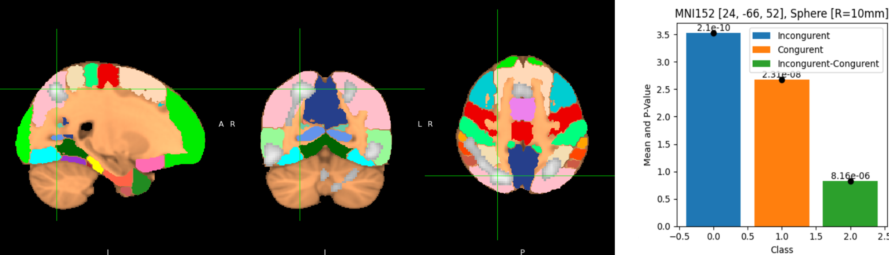
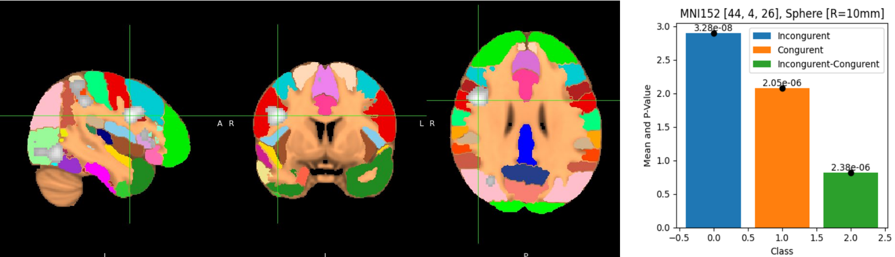

# Cognitive Neuroscience fMRI Analysis: A Comprehensive Report

## Abstract

This README provides a detailed analysis of an fMRI dataset to explore the neural mechanisms underlying cognitive control. The study involves preprocessing, statistical modeling, and post-analysis using FSL software. The results highlight variations in brain activation between different experimental conditions and their implications for cognitive control processes.

## Table of Contents

- [Introduction](#introduction)
- [Experimental Design](#experimental-design)
- [Data Collection](#data-collection)
- [Analysis](#analysis)
  - [Quality Control](#quality-control)
  - [Preprocessing](#preprocessing)
  - [First-Level Analysis](#first-level-analysis)
  - [Second-Level Analysis](#second-level-analysis)
  - [Third-Level Analysis](#third-level-analysis)
  - [ROI Analysis](#roi-analysis)
- [Results and Interpretation](#results-and-interpretation)
- [Discussion](#discussion)
- [Conclusion](#conclusion)
- [References](#references)
- [Submission](#submission)
- [Scripts](#scripts)

## Introduction

This report focuses on analyzing cognitive control mechanisms using fMRI data. The experimental design, data collection, and processing pipeline are presented to investigate how different brain regions contribute to cognitive control and response inhibition.

## Experimental Design

 
Figure 1, Flanker Task Trial

The experiment follows a task-based fMRI design where participants engage in cognitive control tasks with varying difficulty levels. The goal is to assess neural activity under different conditions.

## Data Collection

A total of 30 adult participants completed the experiment. High-resolution anatomical scans and functional MRI data were acquired for each subject.

## Analysis

 
Figure 2, Project Workflow

### Quality Control

Motion artifacts and data inconsistencies were identified and addressed to improve the reliability of the analysis.

 
Figure 3, QC Sample

### Preprocessing

Preprocessing steps included:
- Brain extraction using BET.
- Motion correction using MCFLIRT.
- Spatial smoothing with a 5mm Gaussian kernel.
- Registration and normalization to the MNI152 template.

 
Figure 4, Brain extraction sample, t = 0.1 "RED" and t = 0.5 "BLUE"

### First-Level Analysis

General Linear Model (GLM) analysis was conducted with separate conditions for task performance. Contrasts were defined to compare experimental conditions.

 
Figure 5, Registration of highres to standard

 
Figure 6, Rendered threshold zstat3 run1, The difference between incongruent and congruent.

### Second-Level Analysis

Second-level group analysis was performed using Fixed Effects modeling. This step helps in identifying consistent activation patterns across subjects.

 
Figure 7, Group analysis statistical results.

### Third-Level Analysis

Higher-level analysis using FLAME 1 was conducted to account for inter-subject variability and generate population-level inferences.

 
Figure 8, The difference between Flame 1 and Flame 1 + 2 in fsleyes.

 
Figure 9, The 3D view of the clusters.

### ROI Analysis

Regions of interest (ROIs) were defined using a probabilistic atlas, focusing on the prefrontal cortex and anterior cingulate cortex, which are key regions for cognitive control.

 
Figure 10, The paracingulate gyrus from the atlas.

 
Figure 11, the output of the mask in fsleyes.

## Results and Interpretation

### Lateral Occipital Cortex, Inferior Division
 
Figure 12, Lateral Occipital Cortex, Inferior Division

### Lateral Occipital Cortex, Superior Division
 
Figure 13, Lateral Occipital Cortex, Superior Division

### Precentral Gyrus
 
Figure 14, Precentral Gyrus

## Discussion

The findings align with existing literature on cognitive control, reinforcing the involvement of frontal brain regions in regulating attention and response selection.

## Conclusion

This study contributes to the understanding of cognitive control mechanisms by leveraging fMRI data analysis techniques. The results provide insights into how the brain adapts to complex decision-making tasks.

 
Figure 15, Temporal Gyrus.

 
Figure 16, Superior Parietal Lobule.

## References

- Poldrack, R. A. (2007). The role of fMRI in cognitive neuroscience: Prospects and challenges.
- Smith, S. M. (2004). Overview of fMRI analysis techniques.

## Submission

This report was prepared for the "fMRI Data Analysis" course under the supervision of Dr. [Your Supervisor's Name].

## Scripts

All scripts used for preprocessing and analysis are available in the [scripts](scripts/) directory.

